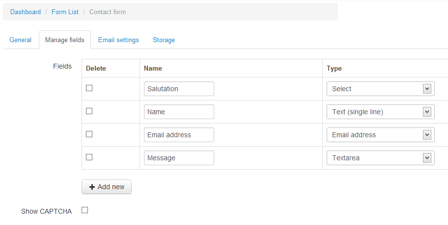

Netvlies FormBundle
===================

[](https://packagist.org/packages/netvlies/form-bundle)
[](https://packagist.org/packages/netvlies/form-bundle)

The Netvlies FormBundle enables users to create basic forms through the Sonata
Admin Bundle. It includes form configuration, storage of results, sending of
notifications when a form is filled in and even the possibility to export form
results through the Sonata list view.



Forms created using the FormBundle can be retrieved using the form service or
be directly shown by using the show_form function provided by the FormBundle
Twig extension.

[](http://knpbundles.com/netvlies/NetvliesFormBundle)

## Requirements

* Symfony
* Dependencies:
 * [`PHPExcel`](https://github.com/ddeboer/phpexcel)

## Installation

### Install the bundle

``` bash
$ curl -s http://getcomposer.org/installer | php
$ php composer.phar require netvlies/form-bundle
```

Composer will install the bundle to your project's `vendor/netvlies` directory.

### Enable the bundle via the kernel

``` php
<?php
// app/AppKernel.php

public function registerBundles()
{
    $bundles = array(
        // ...
        new Netvlies\Bundle\NetvliesFormBundle\NetvliesFormBundle(),
        new Gregwar\CaptchaBundle\GregwarCaptchaBundle(),
    );
}
```

## Configuration

By default the bundle uses default Symfony form rendering and provides
configuration to customize the templates used.

```yaml
netvlies_form:
    templates:
        form: MyBundle:Form:form.html.twig
        fields: MyBundle:Form:fields.html.twig
```

Read the documentation on [`form customization`](http://symfony.com/doc/current/cookbook/form/form_customization.html)
for more information on tweaking the form layout for your project.

## Routing

This bundle requires no specific routing configuration.

## Usage

After installation and configuration, the service can be directly referenced
from within your controllers.

```php
<?php
public function indexAction($formId)
{
    $form = $this->get('netvlies.form')->get($formId);

    ...
}
```

Or directly from the view.

```php

{{ show_form(formId) }}
```

## Form submit and success handling

The bundle provides a default success listener which handles default
functionality like storing a result and sending a confirmation email (when
enabled through the admin). Of course you can implement your own application
specific success handling by overriding the default listener
(netvlies.listener.form.success) or attaching an additional listener. Whichever
option you prefer. The same holds for the submit listener, which handles the
form posts.

### Attaching an additional listener

``` yml
// app/config/services.yml

acme.listener.form.success:
    class: Acme\DemoBundle\EventListener\FormSuccessListener
    calls:
      - [ setContainer, [@service_container] ]
    tags:
      - { name: kernel.event_listener, event: form.success }
```

### Overriding the default listener

``` yml
// app/config/services.yml

netvlies.listener.form.success:
    class: Acme\DemoBundle\EventListener\FormSuccessListener
    calls:
      - [ setContainer, [@service_container] ]
    tags:
      - { name: kernel.event_listener, event: form.success }
```

### Translations

The bundle makes use of the Symfony validation messages and provides
translation files for bundle specific captions. All of these translations can
be overridden by creating your own translation files and putting them in one of
the directories specified in the [`translations documentation`](http://symfony.com/doc/2.1/book/translation.html#translation-locations-and-naming-conventions).

For instance, to customize the messages for your application, you could create
the following translations file.

``` yml
// app/Resources/translations/validators.nl.yml

This value should not be blank.: Dit veld mag niet leeg zijn.
This value is not a valid email address.: Dit is geen geldig e-mailadres.
```

### Contribute

You can contribute to this bundle by issuing a [`pull request`](https://help.github.com/articles/using-pull-requests).
The following are improvements we would like to see implemented somewhere in
the near future.

* File upload field
* Easy injection / registration of custom field types
* Functional tests

Please note that the goal of this bundle is enabling the end user to easily
create basic forms and not to create a complex one-bundle-fits-all solution
that handles all possible types of forms. So please keep it simple.
